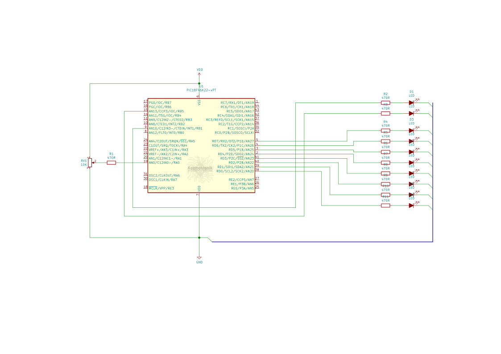

## Port: MPLABX > XC8 > PIC18 Örnek 1


Bu örnekte toplamda 4 ayrı görev çalışmaktadır. Bu görevler sırasıyla:  
* Led çakarlama 1
* Led çakarlama 2
* Karaşimsek
* Karaşimşek hızı okuma

Şimdi sırasıyla bu görevlerin ne yaptığına kısaca değinelim.

### Görev LED Çakarlama 1
Bu görevde tek bir LEDde türlü sinyal desenleri gösterilmektedir. Çıkışa bağlı bir LED dinamik olarak değişen süre aralıklarıyla yanıp söner. Bu aralıklar milisaniye türünden sırasıyla şöyledir: *50, 60, 70, 80, 90, 100, 200, 300, 400, 500, 600, 700, 800, 900, 1000*. `char` türünde bir seçici değişken sırayla bu listeden süre değerlerini alır ve bir sonraki gecikmeye uygular. Görev 50ms gecikme ile başlayıp 1000ms gecikmeye doğru çalışır, ardından 1000ms gecikmeden 50ms gecikmeye doğru çalışır ve bu sonsuza dek bu şekilde sürer.

### Görev LED Çakarlama 2
Bu görev de ilk görevdekine benzer bir uygulama yapılmıştır ancak çakarlama deseni farklıdır. LED 50ms aralıklarla 3 kez yanar ve söner, son sönüşte 1sn bekler ve bunu yineler.

### Görev Karaşimşek
8 adet LED üzerinde çok basit bir karaşimşek animasyonu gösterir. Animasyon hızı analog girişten okunan değere bağlıdır. Animasyon hızı, AN0 ucuna bağlı bir POT ile okunan değere bağlı olarak 10ms - 200ms aralığında değişir.

### Görev Karaşimşek Hızı Okuma (Analog)
Karaşimşek görevine animasyon hızını sağlayan görevdir. AN0 analog girişine bağlı bir POT ile okunan 10 bit analog-dijital gerilim dönüşüm değeri bir hesaplama işlemiyle 10ms - 200ms süre aralığına ölçeklenir ve karaşimşek görevine animasyon hızı olarak sunulur.
<br/><br/>

***
Örneğin çalışmasını gösteren video:
[](https://youtu.be/TKViX1dKXcM)  

Örnek uygulamanın her iki çalışma kipi için derleme sonrası bellek tablosu özetleri aşağıdadır:

Normal kip:
```text
Memory Summary:
    Program space        used   900h (  2304) of 10000h bytes   (  3.5%)
    Data space           used    83h (   131) of   F38h bytes   (  3.4%)
    Configuration bits   used     7h (     7) of     7h words   (100.0%)
    EEPROM space         used     0h (     0) of   400h bytes   (  0.0%)
    ID Location space    used     8h (     8) of     8h bytes   (100.0%)
```

Hafif kip:
```text
Memory Summary:
    Program space        used   796h (  1942) of 10000h bytes   (  3.0%)
    Data space           used    67h (   103) of   F38h bytes   (  2.6%)
    Configuration bits   used     7h (     7) of     7h words   (100.0%)
    EEPROM space         used     0h (     0) of   400h bytes   (  0.0%)
    ID Location space    used     8h (     8) of     8h bytes   (100.0%)
```
``` 
