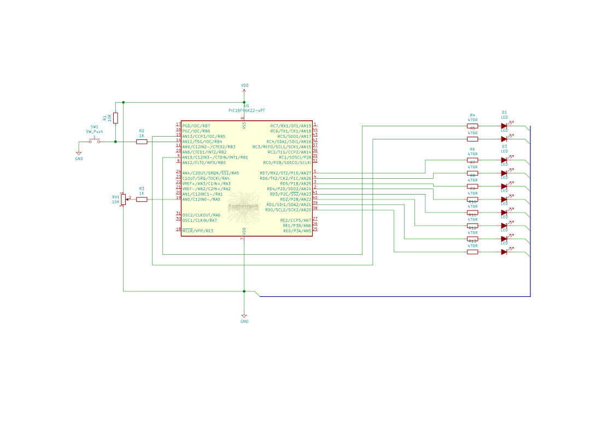

## Port: MPLABX > XC8 > PIC18 Örnek 2


Bu örnekte toplamda 7 ayrı görev çalışmaktadır. Bu görevler sırasıyla:  
* Led çakarlama 1
* Led çakarlama2
* Karaşimsek
* Karaşimşek hızı okuma
* Gösterge değeri hesaplama
* Gösterge içerik güncelleyici
* Gösterge içerik değiştirici

Şimdi sırasıyla bu görevlerin ne yaptığına kısaca değinelim.

### Görev LED Çakarlama 1
Bu görevde tek bir LEDde türlü sinyal desenleri gösterilmektedir. Çıkışa bağlı bir LED dinamik olarak değişen süre aralıklarıyla yanıp söner. Bu aralıklar milisaniye türünden sırasıyla şöyledir: *50, 60, 70, 80, 90, 100, 200, 300, 400, 500, 600, 700, 800, 900, 1000*. `char` türünde bir seçici değişken sırayla bu listeden süre değerlerini alır ve bir sonraki gecikmeye uygular. Görev 50ms gecikme ile başlayıp 1000ms gecikmeye doğru çalışır, ardından 1000ms gecikmeden 50ms gecikmeye doğru çalışır ve bu sonsuza dek bu şekilde sürer.

### Görev LED Çakarlama 2
Bu görev de ilk görevdekine benzer bir uygulama yapılmıştır ancak çakarlama deseni farklıdır. LED 50ms aralıklarla 3 kez yanar ve söner, son sönüşte 1sn bekler ve bunu yineler.

### Görev Karaşimşek
8 adet LED üzerinde çok basit karaşimşek animasyonu gösterir. Ancak animasyon hızı analog girişten okunan değere bağlıdır. Çalışma hızı aralığı 10ms - 200ms arasındadır. Bu görev içerisinde karaşimşek animasyonu bir iç yazmaç üzerinde oynatılırken, animasyon dış dünyaya *İçerik Güncelleyici* görevinde yansıtılır.

### Görev Karaşimşek Hızı Okuma (Analog)
Karaşimşek görevine çalışma hızını sağlayan görevdir. Analog girişine bağlı bir POT ile okunan 10 bit analog-dijital gerilim dönüşüm değeri bir hesaplama işlemiyle 10ms - 200ms süre aralığına ölçeklenir ve karaşimşek görevine çalışma hızı olarak sunulur.  
Bu değer değişimi içerik değiştirme tuşuna basılarak karaşimşek animasyonunun çalıştığı 8 LED üzerinde gösterilebilir.

### Görev Gösterge Değeri Hesaplama
İçerik tuşu kullanılarak 8 LEDin göstereceği içerik karaşimşek hızı göstergesi olarak seçilmişse bu görev POT ile hız ayarı yapılırken, hesaplanan karaşimşek hızını 8 LED üzerinde gösterilecek şekilde hesaplar ve *İçerik Güncelleyici* görevini sinyaller.

### Görev İçerik Güncelleyici
*İçerik Değiştirici* görevinde 8 LEDli göstergede görüntülenmek istenen iki içerikten birini gösterir. Birbirinden bağımsız çalışan iki içerik şunlardır:
- Karaşimşek (animasyon)
- Karaşimşek hız ayarı (düzey göstergesi)

### Görev İçerik Değiştirici
Girişe bağlı bir tuşu dinler, tuş basıldığını saptadığında 8 LEDde hangi içeriğin gösterileceğini belirler.
<br/><br/>

***
Örneğin çalışmasını gösteren video:
[](https://youtu.be/JSWFKb2NSjQ)  

Örnek uygulamanın her iki çalışma kipi için derleme sonrası bellek tablosu özetleri aşağıdadır:

Normal kip:
```text
Memory Summary:
    Program space        used   C0Dh (  3085) of 10000h bytes   (  4.7%)
    Data space           used    82h (   130) of   F38h bytes   (  3.3%)
    Configuration bits   used     7h (     7) of     7h words   (100.0%)
    EEPROM space         used     0h (     0) of   400h bytes   (  0.0%)
    ID Location space    used     8h (     8) of     8h bytes   (100.0%)
```

Hafif kip:
```text
Memory Summary:
    Program space        used   A59h (  2649) of 10000h bytes   (  4.0%)
    Data space           used    5Ah (    90) of   F38h bytes   (  2.3%)
    Configuration bits   used     7h (     7) of     7h words   (100.0%)
    EEPROM space         used     0h (     0) of   400h bytes   (  0.0%)
    ID Location space    used     8h (     8) of     8h bytes   (100.0%)
```
