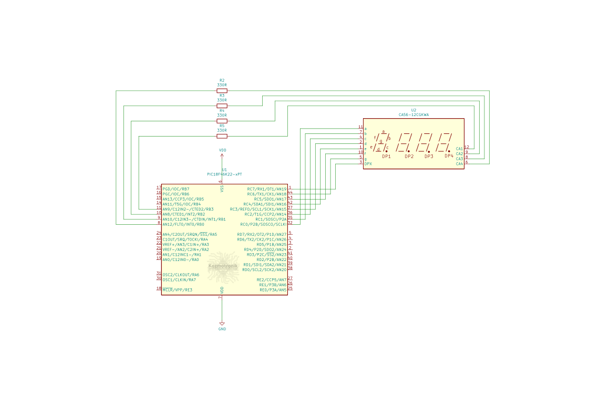

## Port: MPLABX > XC8 > PIC18 Örnek 4



Örnek 4, `uckuyruk` API' sinin kullanımını örneklemek için yazılmıştır. Toplamda 4 görev olup *Normal kip*te çalışmaktadır. Bu görevler:  
* Üretici 1
* Üretici 2
* Gösterge Değeri Güncelleme
* Gösterge Tarama
​
Sırasıyla bu görevlerin ne yaptığına kısaca değinelim.
​
### Görev Üretici 1
uretici1, 0' dan 252' ye kadar sıralı çift sayılar üretir, kuyruk1' in kilidini alır, sayıyı kuyruk1' e kuyruklar, kilidi salar ve ardından kontrolü sonraki göreve bırakır.
​
### Görev Üretici 2
uretici2, 1' den 253' e kadar sıralı tek sayılar üretir, kuyruk1' in 
kilidini alır, sayıyı kuyruk1' e kuyruklar, kilidi salar ve ardından kontrolü sonraki göreve bırakır.
​
### Görev Gösterge Değeri Güncelleme
Bu görev uretici1 ve uretici2' den kuyruklanan sayı değerlerini 7 parçalı LED göstergede göstermek için 4 hanelik BCD formatına dönüştürür. Güncelleme aralığı 500 ms olduğundan ve bu görev kuyruk1' in tek tüketicisi olduğundan, kuyruk1 bu süre boyunca dolu kalacak ve uretici görevler bloklanacaktır.
​
### Gösterge Tarama
Basit bir 4 x 7 parçalı LED gösterge sürme görevidir. Dört haneyi 5 milisaniyede bir çoğullar. Bu uygulamada göstergede yarımşar saniye aralıklarla sırasıyla 0 - 253 değerleri görülür.
<br/><br/>
​
***
Örneğin çalışmasını gösteren video:
[](https://youtu.be/fslfFQ89gnM)  

Örnek uygulamanın derleme sonrası bellek tablosu özetleri aşağıdadır:
​
Normal kip:
```text
Memory Summary:
    Program space        used   991h (  2449) of 10000h bytes   (  3.7%)
    Data space           used    72h (   114) of   F38h bytes   (  2.9%)
    Configuration bits   used     7h (     7) of     7h words   (100.0%)
    EEPROM space         used     0h (     0) of   400h bytes   (  0.0%)
    ID Location space    used     8h (     8) of     8h bytes   (100.0%)
```
