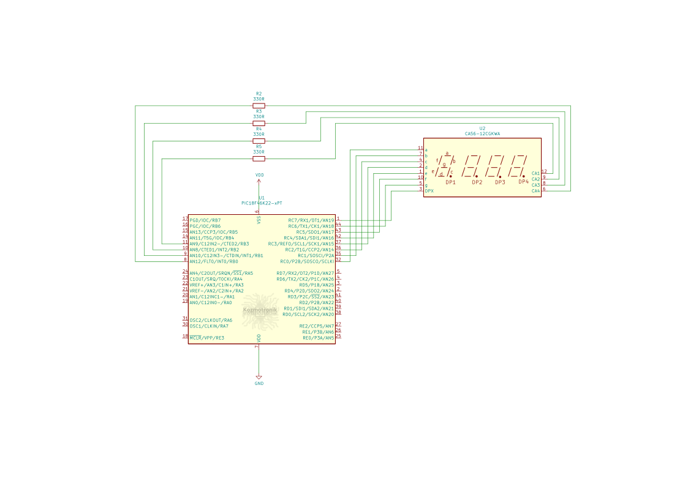

## Port: MPLABX > XC8 > PIC18 Örnek 5



Örnek 5, `uckuyruk` API' sinin çoklu kuyruklama ve çoklu kuyruktan alma kullanımını örneklemek için yazılmıştır. Toplamda 4 görev olup *Normal kip*te çalışmaktadır. Bu görevler:  
* Üretici 1
* Üretici 2
* Gösterge Değeri Güncelleme
* Gösterge Tarama

Sırasıyla bu görevlerin ne yaptığına kısaca değinelim.

### Görev Üretici 1
uretici1 görevi; 20, 30, 40 ve 50 sayılarını içeren diziyi topluca önce kuyruk1' e kuyruklar, sonra kuyruk2' nin kilidini alır ve aynı verileri yine toplu olarak kuyruk2' ye kuyruklar. kuyruk2' ye kuyruklama işlemini bitirdikten sonra kuyruk2' nin kilidini salar ve ardından kontrolü sıradaki göreve verir.

### Görev Üretici 2
uretici2; önce üretici1'in kuyruk1' e kuyrukladığı verileri topluca kuyruktan veri2 dizisine alır, veri2 dizisinde bu verilere 100 değerini ekler. Böylece üretici1'in kuyrukladığı 20, 30, 40 ve 50 değerleri bu işlemden sonra veri2 dizisi 120, 130, 140 ve 150 değerlerini içeriyor olacaktır. Ardından bu görev kuyruk2' nin kilidini alır ve bu artırılan değerleri kuyruk2'ye topluca kuyruklar. Kuyruklama işlemini bitirdikten sonra kuyruk2' nin kilidini salar ve kontrolü sıradaki göreve bırakır.

### Görev Gösterge Değeri Güncelleme
Bu görev uretici1 ve uretici2' den kuyruklanan sayı değerlerini 7 parçalı LED göstergede göstermek için 4 hanelik BCD formatına dönüştürür. Güncelleme aralığı 1 saniye olduğundan ve bu görev kuyruk2' nin tek tüketicisi olduğundan, kuyruk2 bu süre boyunca dolu kalacak ve uretici görevler bloklanacaktır.

### Gösterge Tarama
Basit bir 4 x 7 parçalı LED gösterge sürme görevidir. Dört haneyi 5 milisaniyede bir çoğullar. Bu uygulamada göstergede birer saniye aralıklarla sırasıyla şu sayılar görünür:
20, 30, 40, 50, 120, 130, 140, 150
<br/><br/>

***
Örneğin çalışmasını gösteren video:
[](https://youtu.be/p6dBoL7XbDs)  

Örnek uygulamanın derleme sonrası bellek tablosu özetleri aşağıdadır:

Normal kip:
```text
Memory Summary:
    Program space        used   BCAh (  3018) of 10000h bytes   (  4.6%)
    Data space           used    88h (   136) of   F38h bytes   (  3.5%)
    Configuration bits   used     7h (     7) of     7h words   (100.0%)
    EEPROM space         used     0h (     0) of   400h bytes   (  0.0%)
    ID Location space    used     8h (     8) of     8h bytes   (100.0%)
```
